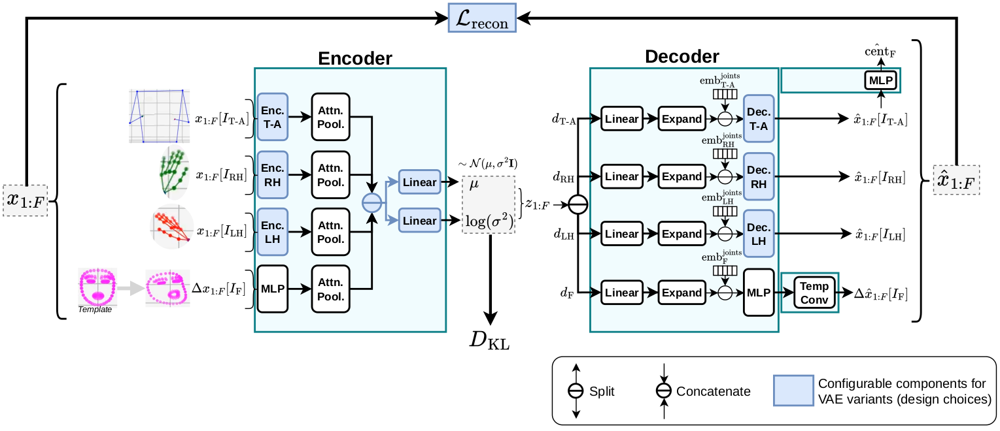
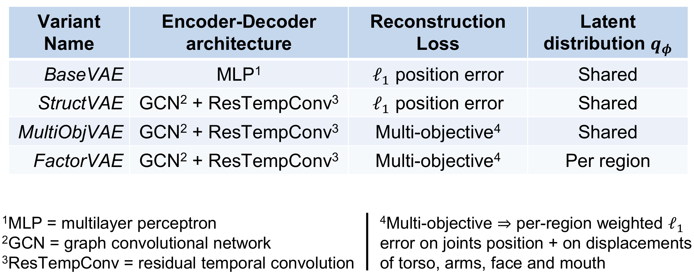

# SignPoseVAE
Official implementation of Sign Pose VAEs from the paper "The Impact of VAE Design on Latent Pose Representations for Diffusion-basedSign Language Production" (CVPRW GenSign 2026).

<p align="center">
  
</p>
<p align="center">
  <b>Architecture of the Sign Pose VAE.</b>
</p>

---
## Table of Content

[1. Overview](#1-overview)

[2. Setup](#2-setup)

[3. Usage](#3-usage)

[4. Outputs examples](#4-outputs-examples)

[Citation](#citation)

---

## 1. Overview

This repository provides scripts and tools to:
- easily define multiple variants of
Variational Autoencoders (VAEs) to encode skeletal pose sequences
- train them
- evaluate them and characterize their latent space through different metrics

It is typically made to be used in the context of sign language processing
tasks and in particular for sign language production, e.g. when using 
a latent diffusion model (or conditional flow matching on latent space), which
is for what it was built.

#### i. Input data format

Originally, the VAE expects as input 178-key points skeletal data as defined in
https://github.com/walsharry/SLRTP_Skeleton_Keypoint_information.
Other skeletal data formats can be handled modulo some adaptation of the scripts notably
in:
- [data/skeletal_data.py](data/skeletal_data.py) (contains the definition of regions nodes and graph connections)
- [model/autoencoders/skelmotionmultivae.py](model/autoencoders/skelmotionmultivae.py)

#### ii. General VAE design

The VAE is defined through the `SkelMotionMultiRegionVAE` class which separates
the input in 4 regions: the torso + arms, the right hand, the left hand and
the face. Note that for the face, inputs are transformed by the model before
encoding to landmarks coordinates displacements at each frame from
a "neutral" (mean) face template.

Each region inputs are processed by independent encoder and decoder modules whose architecture
can be modified in the configuration file under the `model` keyword (cf. configuration examples
in the [configs/](configs) folder. However, one can either choose to
predict the latent distribution parameters $\mu$ and $\sigma^2$ from a concatenation
of the different encoders outputs (setting the `shared_latent_distribution` parameter to
`True`) or to predict independent normal distributions parameters per-region 
(`shared_latent_distribution=False`).

Please refer to the scheme and/or the paper for more details.

#### iii. Training loss design

To train the VAE, we adopt the approach of 
[I. Higgins et al. *beta-VAE* 2017 paper](https://openreview.net/pdf?id=Sy2fzU9gl) by
minimizing the following loss:

$$\mathcal{L}_{\text{VAE}}:=\mathcal{L}_{\text{recon}} + \beta~ D_\text{KL} \left( \mathcal{N}(\mu, \sigma^2 \textbf{I}) || \mathcal{N}(0, \textbf{I}) \right)$$

The base **reconstruction loss** is a $\ell_1$ error loss (MAE) with the same scaling factor for each
region error but can be changed in the configuration file under the `losses: recon` key-words.
For instance, the following configuration:
```yaml
losses:
  recon:
    list_losses:
      - torsoarms_position
      - rh_position
      - lh_position
      - face_position
      - torsoarms_velocity
    scaling_factors:
      torsoarms_position: 10.
      rh_position: 20.
      lh_position: 15.
      face_position: 5.
      torsoarms_velocity: 7.5
    losses_params:
      torsoarms_position:
        loss: mse
      rh_position:
        loss: l1
      lh_position:
        loss: l1
      face_position:
        loss: l1
      torsoarms_velocity:
        loss: mse
```

is equivalent to

$$
\begin{aligned}
\mathcal{L}_{\text{recon}}
:= \frac{1}{F}\sum_f \Bigg(
&\frac{10}{N_\text{T-A}}
\sum_{j\in \text{T-A}}
\| x_{j,f} - \hat{x}_{j,f} \|_2^2 + \frac{20}{N_\text{RH}}
\sum_{j\in \text{RH}}
\| x_{j,f} - \hat{x}_{j,f} \|_1 \\
+& \frac{15}{N_\text{LH}}
\sum_{j\in \text{LH}}
\| x_{j,f} - \hat{x}_{j,f} \|_1 + \frac{5}{N_\text{Face}}
\sum_{j\in \text{Face}}
\| x_{j,f} - \hat{x}_{j,f} \|_1
\Bigg) \\
+& \frac{1}{F-1}\frac{7.5}{N_\text{T-A}}
\sum_{j\in \text{LH}}
\| (x_{j,f+1} - x_{j, f}) - (\hat{x}_{j,f+1} - \hat{x}_{j,f}) \|_2^2
\end{aligned}
$$

where $x_{j,f}$ and $\hat{x}_{j,f}$ are respectively the $j$-th joint 3D coordinates of ground truth and predicted poses
at frame $f$.

In the case of a factorized latent distribution $\Pi_{r \in \text{Regions}}q_{\phi_r}(z[r]|x[r])$
, we use a weighted sum of **Kullback-Leibler divergence loss** defined on each region $r$'s latent poses, i.e:

$$ D_\text{KL} = \sum_{r\in \text{Regions}} w_r ~ D_\text{KL}^{(r)}.$$

In that case, the latent dimensions of each region and scaling factors must be defined
in the configuration file under the `losses: kl` key-words following the same logic as the
following example:

```yaml
  kl:
    sub_kl_dims: [10, 24, 24, 6]  # order TORSO+ARMS | RH | LH | FACE (must match latent dims)
    sub_kl_factors: [1., 1., 1., .1]
    scaling_factor: 0.25  # global scaling factor to multiply D_KL
```

For "shared" latent distribution, only the global `scaling_factor` can be defined (default to 1.).

#### iv. The VAE variants

Although one can define its own personalized configuration for 
encoder-decoder architectures, regions' latent dimensions and distribution,
we provide the curated configurations of the 4 variants studied in our paper
in the [configs/](configs) folder. The following table is a recap of the
main differences between variants:

<p align="center">
  
</p>
<p align="center">
  <b>Sign Pose VAE variants.</b>
</p>

## 2. Setup

**To instantiate and train Sign Pose VAEs**

First, clone the repository:

```bash
git clone https://github.com/sign-language-processing/pose-evaluation.git
```

Second, create a virtual environment and once activated, run the following command to
install the required packages:

```bash
pip install -r requirements.txt
```

**To evaluate the VAEs outputs**

Then, iff you want to compute evaluation metrics on reconstructed poses,
please follow the instructions below.

Install manually the
https://github.com/sign-language-processing/pose-evaluation repository as a package, 
to allow for the computation of some additional geometric metrics for evaluation (namely DTWp):

```bash
pip install git+https://github.com/sign-language-processing/pose-evaluation.git
```

Finally, to install the tools needed for the evaluation of sign poses reconstruction quality:
- in the `utils/metrics` folder, clone https://github.com/walsharry/SLRTP-Sign-Production-Evaluation repository
and rename it to `slrtp_challenge_2025_evaluation`.
- in `utils` create a `slt_models` folder and inside it copy the `back_translation` folder 
of the `slrtp_challenge_2025_evaluation` repo. Rename it to `slrtp25_bt_phoenix14t`.

At the end, your `utils` folders tree should look like that:

```text
v utils
    v metrics
        > evaluation
        > slrtp_challenge_2025_evaluation  # Contains SLRTP-Sign-Production-Evaluation without back_translation
    > slt_models
        > slrtp25_bt_phoenix14t  # SLRTP-Sign-Production-Evaluation/back_translation content
    > visualization
```

## 3. Usage

> [!NOTE]
> NB: before using latent pose representations to train a latent generative model,
> we recommend standardizing the latent poses as ??? (and de-standardize the generated outputs before
> decoding).

## 4. Outputs examples

---

### Citation

If you use this repository for your research, please cite it as follows:
```text
@InProceedings{Faure_2026_CVPR,
    author    = {Faur\'e, Guilhem and Sadeghi, Mostafa and Bigeard, Sam and Ouni, Slim},
    title     = {The Impact of VAE Design on Latent Pose Representations for Diffusion-based Sign Language Production},
    booktitle = {Proceedings of the IEEE/CVF Conference on Computer Vision and Pattern Recognition (CVPR) Workshops},
    month     = {June},
    year      = {2026},
    pages     = {10631-10640}
}
```